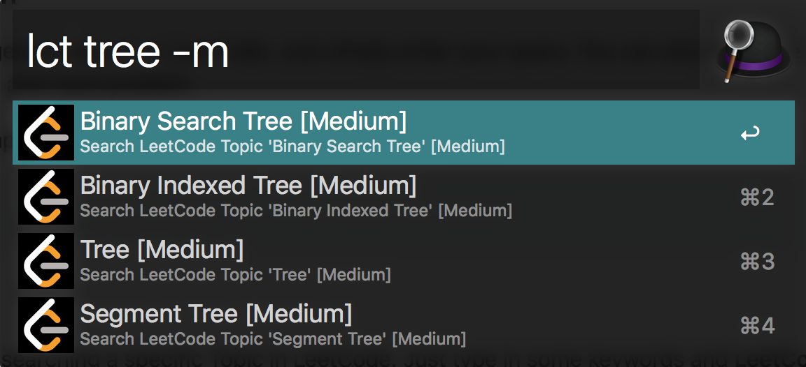

# LeetCode Search for Alfred Workflow

    

**LeetCode Search** is an [Alfred](https://www.alfredapp.com) Workflow plugin for searching algorithm problems in [LeetCode](https://leetcode.com) with custom options.


## 1. Download

You can download the latest version in [Github releases page](https://github.com/TooSchoolForCool/LeetCode-Search/releases/tag/1.0.0).


## 2. Usage

### 2.1 General Search

Try keyword `lc` for general search in LeetCode. Just simply enter your query. You can also enter `-e`, `-m` and `-h` to specify Easy, Medium and Hard problem. 


Here is a simple example to search Hard problem with keyword *knapsack*

```
lc knapsack -h
```


### 2.2 Serach Topic

Try keyword `lct` for searching a specific Topic in LeetCode. Just type in some keywords and **LeetCode Search** will automatically suggests you some related topics. 

*Note: These topics are pre-defined by LeetCode, if no related topic is matched, then a general search will be performed.*


Here is a simple example to search Medium problem in `tree` related topics.




You can also try some other keyword, like `search`, `string`, `dp`, or you can just enter the topic listed on the LeetCode, it works as well.


## Acknowledgement

This Alfred Workflow plugin is developed based on [deanishe/alfred-workflow](https://github.com/deanishe/alfred-workflow). Thanks for this great helper library.


